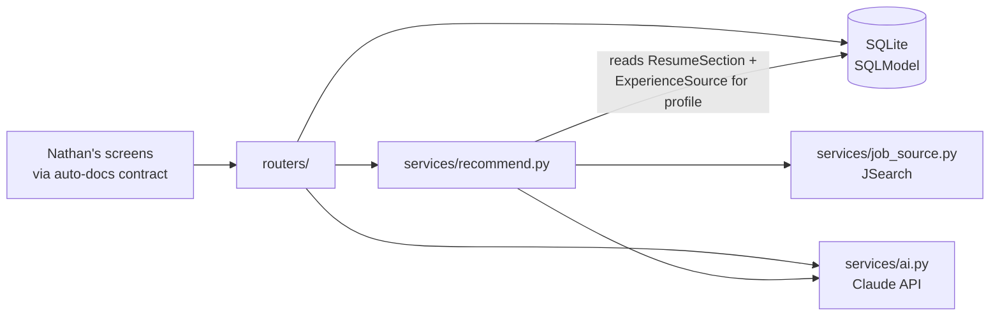

# feat: Backend v1 — thin slices of tracker, resume tailoring, and recommendations

## Overview

Build `backend/` from scratch: a FastAPI + SQLite application delivering thin slices of all three features from Nathan's idea board — the application tracker (landing-page data), structured-section resume storage with Claude-powered tailoring, and job recommendations fed by a free jobs API. The tracker must work with zero AI configured; AI and the external jobs API sit behind small service seams so they can fail, be mocked, or be swapped without touching the core app.

---

## Problem Frame

Josh and Nathan need one place to run a job search (see origin and `docs/brainstorms/2026-07-25-app-features-requirements.md`). Nathan prototypes the screens; Josh + Claude Code build both halves. The backend is the first code in the repo, so this plan also establishes the project's conventions: layout, test setup, and the API contract surface (FastAPI auto-docs) that Nathan's screens will be built against.

---

## Requirements Trace

From the origin doc (`docs/brainstorms/2026-07-25-backend-build-requirements.md`):

- R1. Job entity: company, position, description, links, source (manual/recommended), status pipeline, dates, comments, contacts
- R2. Master resume as ordered named sections; tailored resumes are derived copies recording which job and which sections changed; master never modified
- R3. Configuration: job-side parameters + experience-match sources (all four types stored; v1 matching reads resume + manual input)
- R4. SQLite local file (git-ignored); Claude API key in `.env`
- R5. Jobs CRUD + search/filter powering the landing page
- R6. Per-job sub-resources: comments, contacts, links, status changes with dates
- R7. Config read/update endpoints
- R8. Resume endpoints: import (paste or PDF → parsed sections), read, tailor, edit tailored sections
- R9. Recommendations: manual refresh fetches + scores + inserts; dismissible; no background scheduler
- R10. FastAPI auto-docs stay accurate as the API contract for the frontend
- R11. Two small separate AI services: match-scoring and section-tailoring (review-only, never auto-applied). *Realized as one `services/ai.py` module with separate per-task functions — a deliberate reading of "separate and small" at this scale.*

**Origin flows** (features doc): F1 daily check-in (tracker), F2 automated recommendations, F3 tailored resume for a posting.

---

## Scope Boundaries

Carried from origin:
- No background jobs/scheduling — refresh is user-triggered
- No webpage/case-study fetching for the experience profile (stored in config, unused by v1 engine)
- No PDF/docx *export* of tailored resumes
- No auth, no deployment, no multi-user

Plan-local:
- No frontend work — this plan ends at the JSON API; Nathan's prototypes drive `frontend/` later

### Deferred to Follow-Up Work

- Supplemental job feeds (Remotive for remote UX roles, USAJobs for federal science roles) — the `JobSource` interface is designed for them; wiring is a later slice
- Adzuna as a degraded-mode provider (truncated descriptions → title+excerpt scoring or unscored inserts) — only if JSearch's quota proves insufficient in practice

---

## Context & Research

### Relevant Code and Patterns

Greenfield — no code exists. Conventions this plan establishes are themselves the deliverable (see Key Technical Decisions). Charter constraints: conventional and boring, readable by a Claude Code beginner (`CLAUDE.md`).

### External References

Jobs API research (2026-07-25, via web research):
- **JSearch (RapidAPI)** — free tier 200 requests/month, hard cap, no credit card; broadest US coverage (Google for Jobs aggregation); **returns full `job_description` text** (required for AI scoring); remote/work-arrangement field; keyword+location query; pagination; RapidAPI returns remaining-quota rate-limit headers.
- **Adzuna** — self-serve key; larger quota (official ToS up to 2,500/month; sources conflict) but **description field is truncated**, so it cannot serve full-text scoring — degraded mode only.
- **Remotive** (remote/UX roles, no key, full descriptions) and **USAJobs** (federal science roles, free, full descriptions) are the natural supplemental feeds.
- Claude API: per-action costs and model choices already decided in origin doc's AI Cost Model (Haiku 4.5 for scoring, Sonnet for parsing/tailoring; prompt-cache the experience profile).

---

## Key Technical Decisions

- **JSearch primary; Remotive/USAJobs as future supplements; Adzuna only as documented degraded mode:** full description text is non-negotiable for match scoring, and JSearch is the only free general aggregator providing it. The `JobSource` interface must treat `description` as possibly absent so degraded/supplemental providers slot in without redesign. **Fetch quota is budgeted numerically** (dedup conserves *Claude* spend; JSearch requests are the scarce resource): default per-refresh budget of 3 requests (~30 postings), so one daily refresh ≈ 90 requests/month — inside the 200 cap with headroom for extra presses. The refresh endpoint warns and refuses when remaining quota (from RapidAPI rate-limit headers) would drop below a floor (~20), so the feature degrades loudly, not dead-for-half-the-month.
- **SQLModel, with table models internal and API schemas separate where shapes differ:** SQLModel keeps model+schema duplication low for simple tables, but table models are *not* the API contract — internal fields (`dedup_hash`, `source_ref`) must not leak, list/read responses embed derived and nested data, and create/update bodies differ from table rows. Follow the standard SQLModel base + table + `Read`/`Create`/`Update`-variant pattern (at minimum for `Job` and nested reads). This is what keeps R10's auto-docs honest.
- **Alembic migrations from the first schema, in SQLite batch mode:** real application data lands in the DB from day one of the tracker slice; "recreate the DB" is not an acceptable schema-change story. Most Alembic ops on SQLite require batch (table-rebuild) mode — configure it from revision one, and verify migrations against a populated fixture DB, not just an empty one.
- **Status dates as simple columns (resolved with Josh, 2026-07-25):** `Job` carries nullable `applied_at` / `denied_at` / `accepted_at`, auto-set when a `PATCH /jobs/{id}` changes `status` (only if not explicitly provided) and directly editable — so backdating pre-app applications is just editing a date. No `StatusEvent` table, no transition-only endpoint: the origin's "no sub-stages until real use demands them" philosophy wins. Re-application (denied → applied) simply updates `applied_at` (latest wins); full transition history is deliberately not kept in v1.
- **Dismissal is a timestamp, not a status:** `Job.dismissed_at` (nullable) instead of a fifth enum value. The status pipeline stays exactly as the board defines it (not_started → applied → denied/accepted); default list queries filter `dismissed_at IS NULL`; dismissing writes no StatusEvent (it's a recommendation-lifecycle action, not a pipeline transition); restoring = clearing the timestamp; dismissed rows stay in the dedup set. "Keeping" a recommendation needs no endpoint — recommended jobs are already real rows, and any edit or status transition is the keep. To make that mechanically true, **a status change on a dismissed job clears `dismissed_at`** — otherwise an applied job could sit invisible on the default board.
- **Deletion rules protect work product and the dedup set:** `DELETE /jobs/{id}` returns 409 for `source=recommended` jobs (dismiss is the removal path — hard delete would punch a hole in dedup and cause re-fetch/re-score spend) and 409 when a **submitted** tailored copy exists (that link is what the charter protects). Unsubmitted tailored copies are disposable work product: `DELETE /tailored/{id}` removes them (409 only when `is_submitted`), so a garbage tailor never makes its job permanently undeletable. Manual jobs with no submitted copy hard-delete with cascade to comments/contacts/links (any unsubmitted copies must be deleted first or cascade with them — deliberate, tested).
- **AI behind one `services/ai.py` seam, models per task:** `claude-haiku-4-5` for match scoring, `claude-sonnet-5` for resume parsing and tailoring (per origin AI Cost Model). Structured outputs (Pydantic via the SDK's parse helper) for anything the app stores. App boots and tracker works with no key configured; AI endpoints return a clear 503-style error instead. **Job-description text is untrusted external data:** scoring and tailoring prompts delimit and label it as data-not-instructions and tell the model to ignore any directives embedded in it — postings come from the open web and feed both the scores Josh reads and the resume text he may submit.
- **uv for Python env/deps:** single tool, lockfile, one-command setup (`uv sync`) — friendliest to the "runnable by a beginner" requirement (tech-stack R7). Dependencies declared in `pyproject.toml`.
- **Dedup: DB-enforced where exact, best-effort where fuzzy.** Partial unique index on `source_ref` (where not null) is the hard backstop — a double-clicked refresh cannot insert the same provider posting twice, because the constraint, not the check, is the last line of defense. `dedup_hash` is explicitly a **best-effort heuristic**, not a guarantee: computed for *all* jobs (manual creates and company/position edits included) with defined normalization — lowercase, strip punctuation, collapse whitespace, strip legal suffixes (Inc/LLC/Ltd) — plus the URL host or location folded in so two real postings with the same company+title aren't collapsed into one. Real-world name variance ("Genentech, Inc. / Sr. Scientist" vs "Genentech / Senior Scientist") will still let some duplicates through, and cross-publisher aggregation gives one posting multiple `source_ref`s; the accepted cleanup path is dismiss. No separate raw-response cache table — dedup rows carry the (best-effort) don't-re-score behavior.
- **Resume section granularity:** one section per logical block and one per experience entry (per-employer) — tailoring targets individual entries.
- **Tailored sections are self-contained:** a `TailoredSection` owns its content *and* its section identity (name, order) copied at tailor time; `base_section_id` is nullable provenance only (`ON DELETE SET NULL`). This is the only design compatible with destructive master re-import (U4) — a tailored copy must render completely with zero live references to master sections.
- **PDF import:** send the PDF bytes directly to Claude (native PDF document support) and parse to sections in one call; paste-text is the same code path minus the document block. No local PDF text-extraction dependency.

---

## Open Questions

### Resolved During Planning

- Jobs API choice → JSearch primary; Remotive/USAJobs supplements deferred; Adzuna degraded-mode only (see decisions)
- Dedup strategy → DB-enforced: partial unique `source_ref` + advisory `dedup_hash` on all jobs; dismissed rows retained
- Section granularity → per-entry sections
- PDF parsing → Claude-native PDF input
- Dismissal model → `dismissed_at` timestamp; status enum unchanged from the board's pipeline
- Which tailored copy was submitted → `TailoredResume.is_submitted` flag, at most one per job, settable via PATCH

### Provisional (needs confirmation before or during the affected unit)

- **Q1 from the features doc — how recommended jobs mix with tracked ones — is provisionally resolved here as one list with a `source` marker,** because recommendations-as-real-`Job`-rows is load-bearing for dedup (U2), the list endpoint (U3), and dismiss/restore (U6). The charter reserves this question for Nathan's landing-page prototype. If his prototype calls for a separate candidates tray, the likely delta is presentational (a `source` filter on the same list) — but confirm before U6 ships dismiss/restore, in case he wants different lifecycle semantics.

### Deferred to Implementation

- Exact JSearch query shaping per config (keyword construction from experience/location/pay params) — tune against real responses
- JSearch free-tier request accounting (does `num_pages > 1` count as one request or N? actual page size?) — verify before hard-coding the per-refresh budget of 3
- Prompt wording for parsing/scoring/tailoring — iterate against real resumes and postings (locally only; committed fixtures are always synthetic — see U4)
- Whether SQLite needs FTS5 for search or `LIKE` is enough at personal-data scale — start with `LIKE`, measure

---

## Output Structure

    backend/
      pyproject.toml
      .env.example
      README.md
      alembic.ini
      alembic/            # migration env (batch mode) + versions/
      app/
        __init__.py
        main.py           # FastAPI app factory, CORS, router mounting
        config.py         # pydantic-settings (.env)
        db.py             # engine/session; enforces PRAGMA foreign_keys=ON per connection
        models.py         # SQLModel tables + API schema variants
        routers/
          jobs.py
          resume.py
          recommendations.py
          settings.py     # config profile endpoints
        services/
          ai.py           # Claude client: parse / score / tailor
          job_source.py   # JobSource interface + JSearchProvider
          recommend.py    # refresh orchestration: fetch → dedup → score → insert
      tests/
        conftest.py       # test app + SQLite fixtures (FKs on, populated fixture DB)
        test_health.py
        test_jobs.py
        test_resume.py
        test_tailor.py
        test_recommendations.py

*Scope declaration, not a constraint — adjust if implementation reveals a better layout.*

---

## High-Level Technical Design

> *Directional guidance for review, not implementation specification.*

Tracker endpoints touch only `routers/ → models` — no service dependencies, which is what keeps R5/R6 alive with zero AI configured. Note the cross-slice seam: `recommend.py` reads resume sections and manual sources to build the experience profile, so a master re-import changes future scoring (by design).

---

## Implementation Units

- U1. **Scaffold the backend project**

**Goal:** Runnable FastAPI app with settings, CORS for the Vite dev server, health endpoint, test harness, and documented one-command startup.

**Requirements:** R4, R10 (docs served); tech-stack R7 (beginner-runnable)

**Dependencies:** None

**Files:**
- Create: `backend/pyproject.toml`, `backend/.env.example`, `backend/README.md`, `backend/app/main.py`, `backend/app/config.py`, `backend/app/db.py`, `backend/tests/conftest.py`, `backend/tests/test_health.py`
- Modify: `README.md` (repo root — add backend quick-start), `.gitignore` (SQLite file, `.venv`; verify the existing `.env` / `.env.*` rules cover `backend/.env` — the app standardizes on `.env`, which the charter's `.env.local` note should be read as)

**Approach:**
- App factory pattern; CORS allows `http://localhost:5173`; `/health` returns app + DB status; settings read `ANTHROPIC_API_KEY`, `JSEARCH_API_KEY`, `DATABASE_PATH` from `.env` — all optional at boot.
- `db.py` enables `PRAGMA foreign_keys=ON` on every connection (SQLite does not enforce FKs by default) and WAL journal mode, so a slow writer never blocks tracker reads.

**Patterns to follow:** Standard FastAPI project conventions (no local patterns exist yet — this unit sets them).

**Test scenarios:**
- Happy path: `GET /health` returns 200 with status payload
- Edge case: app boots with an empty `.env` (no keys) without error
- Edge case: an insert violating a foreign key fails (proves the FK pragma is active on real connections)

**Verification:** `uv sync` + one documented command starts the server; `/docs` renders; tests pass.

---

- U2. **Data model and migrations**

**Goal:** All SQLModel tables plus Alembic (batch mode) wired up with the initial migration.

**Requirements:** R1, R2, R3, R4

**Dependencies:** U1

**Files:**
- Create: `backend/app/models.py`, `backend/alembic.ini`, `backend/alembic/` (env + first revision), `backend/tests/test_models.py`

**Approach:**
- Tables: `Job` (company, position, description, url, source enum manual|recommended, status enum not_started|applied|denied|accepted, nullable `applied_at`/`denied_at`/`accepted_at` status dates, `dismissed_at` nullable timestamp, match_score/rationale nullable, `source_ref` with partial unique index where not null, `dedup_hash`, timestamps), `Comment`, `Contact`, `JobLink` (all job_id FK), `ResumeSection` (name, content, position), `MasterSnapshot` (prior master sections retained on re-import), `TailoredResume` (job_id FK, `is_submitted` bool, created_at) + `TailoredSection` (tailored_resume_id, `base_section_id` nullable FK `ON DELETE SET NULL`, copied section name + order, content, changed flag), `ConfigProfile` (experience, location, pay_min), `ExperienceSource` (type enum resume|case_study|webpage|manual, content/url).
- Invariants stated here, tested here and downstream: tailored sections are fully self-contained (render with zero live master references); status dates auto-set on status change but remain directly editable; dedup's exact layer is DB-enforced.
- API schema variants (`Read`/`Create`/`Update`) live beside the tables; internal fields never appear in `Read` shapes.

**Test scenarios:**
- Happy path: create a job with comments/contacts/links and read them back through relationships
- Happy path: changing status sets the matching date column (`applied` → `applied_at`); an explicitly provided date wins over the auto-set
- Edge case: deleting a manual job (no tailored copies) cascades comments/contacts/links
- Edge case: deleting a `ResumeSection` referenced by a `TailoredSection` nulls `base_section_id` and leaves the tailored section fully renderable (name, order, content intact)
- Edge case: inserting two jobs with the same `source_ref` violates the unique index
- Integration: `alembic upgrade head` runs against a *populated* fixture DB (batch-mode rebuild exercised), not just an empty file

**Verification:** `alembic upgrade head` builds the schema from empty *and* upgrades a populated fixture; models round-trip in tests; FK enforcement proven.

---

- U3. **Tracker API (landing-page slice)**

**Goal:** Full CRUD + search/filter for jobs and their sub-resources — the complete data supply for Nathan's landing page in one round trip, zero AI involved.

**Requirements:** R1, R5, R6, R10; features-doc F1, R1–R5

**Dependencies:** U2

**Files:**
- Create: `backend/app/routers/jobs.py`, `backend/tests/test_jobs.py`
- Modify: `backend/app/main.py` (mount router)

**Approach:**
- `GET /jobs` returns list rows that embed everything Nathan's board row needs without follow-up calls: company, position, status, source, match_score/rationale, the status date columns, derived `last_activity_at` (latest of job update / comment), and counts of comments/contacts/links. Query params: `status`, `include_dismissed` (default false → `dismissed_at IS NULL`), free-text `q` (company/position/description `LIKE`), sort by `last_activity_at`.
- `POST /jobs` (manual add — computes `dedup_hash`, accepts an initial status + dates for backfill), `GET/PATCH/DELETE /jobs/{id}`; PATCH recomputes `dedup_hash` when company/position change. A PATCH that changes `status` auto-sets the matching date column (unless the same request provides it explicitly) and clears `dismissed_at`. All status changes are allowed (including denied → applied for re-applications — `applied_at` updates, latest wins); date columns are directly editable for backdating.
- DELETE: 409 for `source=recommended` (dismiss instead) and 409 when a *submitted* tailored copy exists; otherwise hard delete with cascade.
- Nested `POST/GET/DELETE` for comments, contacts, links.

**Test scenarios:**
- Happy path: add job → appears in list; PATCH status to `applied` → `applied_at` auto-set; add comment/contact/link → counts reflected in the list row
- Happy path: one `GET /jobs` call returns every field on Nathan's landing row (assert the full shape — no follow-up requests needed)
- Happy path: filter by status returns only matching; `q=microscopy` matches description text
- Happy path: backfill — create a job with status `applied` and an explicit last-month `applied_at` → date preserved, not overwritten with today
- Happy path: denied → applied is allowed; `applied_at` updates to the new change (latest wins), `denied_at` retained
- Edge case: empty list returns 200 `[]`; unknown job id returns 404; invalid status value returns 422
- Error path: DELETE on a recommended job → 409; DELETE on a job with a *submitted* tailored resume → 409 with actionable message
- Integration: full lifecycle — create → applied → denied → applied — leaves correct date columns at each step

**Verification:** Every landing-page field on Nathan's board (company, position, status, dates, comments, contacts, links, search/filter) is served by one documented list endpoint; status dates auto-set on changes and stay editable for backfill.

---

- U4. **Master resume: import and sections API**

**Goal:** Import a resume (pasted text or PDF) into structured sections via Claude; read and edit the master's sections.

**Requirements:** R2, R8 (import/read), R11 (parse uses the AI seam)

**Dependencies:** U2; `services/ai.py` created here

**Files:**
- Create: `backend/app/routers/resume.py`, `backend/app/services/ai.py`, `backend/tests/test_resume.py`
- Modify: `backend/app/main.py` (mount router)

**Approach:**
- Two import routes for clean auto-docs (one route cannot be both JSON and multipart): `POST /resume/import/text` (JSON `{text}`) and `POST /resume/import/pdf` (multipart upload). Both call Sonnet via `services/ai.py` with structured output (Pydantic list of `{name, content}`); sections replace the current master (re-import is destructive to master sections but never to tailored copies — they are self-contained by design, see U2).
- PDF uploads are validated before any Claude call: max size (10 MB) and content-type/magic-byte check → 413/415 on failure, no API spend.
- **Re-import snapshots the outgoing master** (prior sections retained as an inactive snapshot) so a plausible-looking-but-bad parse can't silently destroy weeks of hand edits — mirroring R11's review-never-auto-apply principle, which import would otherwise bypass.
- `GET /resume` returns 200 with `sections: []` before any import (never 404 — first-run contract for Nathan's screen); `PATCH /resume/sections/{id}` for manual edits.
- AI errors (no key, API failure) return an explicit error payload, never a 500 stack trace.
- **Fixture rule (applies to U4/U5/U6):** all resume and job-posting content in committed tests/fixtures is synthetic; real-resume prompt iteration happens only against the local DB.

**Execution note:** Mock `services/ai.py` at the boundary in router tests; one narrow unit test for the service's request-shaping only.

**Test scenarios:**
- Happy path: import pasted text (mocked parse) → sections stored in order and returned by `GET /resume`
- Happy path: PATCH a section's content → persisted
- Edge case: `GET /resume` before any import → 200 with empty sections
- Error path: oversized upload → 413; non-PDF bytes → 415; in both cases no AI call made (assert the mock was never invoked)
- Error path: import with no API key configured → clear 503 with actionable message; DB unchanged
- Error path: AI returns malformed/failed parse → 502-style error, DB unchanged
- Integration: re-import replaces master sections; the prior master is retained as a snapshot and inspectable; an existing `TailoredResume` still renders completely (names, order, content, changed-flags) with its `base_section_id`s nulled

**Verification:** A real resume can be imported once and its sections read/edited; tracker endpoints unaffected when AI is unconfigured; first-run screens have a defined contract.

---

- U5. **Tailoring flow**

**Goal:** Produce a tailored resume copy for a job: description in (stored job or pasted text), user-selected sections rewritten by Claude, editable afterward; master untouched; the submitted copy trackable.

**Requirements:** R2, R8 (tailor/edit), R11; features-doc F3, R9–R11

**Dependencies:** U3, U4

**Files:**
- Create: `backend/tests/test_tailor.py`
- Modify: `backend/app/routers/resume.py`, `backend/app/services/ai.py`

**Approach:**
- `POST /jobs/{id}/tailor` with `{section_ids, description_override?}` → creates a `TailoredResume` with self-contained copies of *all* master sections (name/order/content snapshotted), where the selected ones carry Claude-rewritten content flagged as changed; unselected sections are verbatim snapshots.
- `PATCH /tailored/{id}/sections/{id}` for the visual builder's edits; `GET /jobs/{id}/tailored` lists copies (200 `[]` when none); `PATCH /tailored/{id}` can set `is_submitted` — setting it on one copy clears it on the job's others (at most one submitted copy per job).
- `DELETE /tailored/{id}` removes a copy; 409 only when `is_submitted` (the charter-protected link). This keeps failed experiments cleanable and jobs deletable.

**Test scenarios:**
- Happy path: tailor with two selected sections (mocked AI) → copy has rewritten content for those two, verbatim snapshots for the rest, changed-flags correct
- Happy path: edit a tailored section → master section content unchanged (assert explicitly)
- Happy path: mark copy B submitted → copy A's `is_submitted` cleared
- Happy path: delete an unsubmitted copy → gone; delete a submitted copy → 409; job delete succeeds after its only (unsubmitted) copy is removed
- Edge case: tailor a job with no stored description and no override → 422 asking for description
- Edge case: `GET /jobs/{id}/tailored` with no copies → 200 `[]`
- Error path: AI failure mid-tailor → no partial `TailoredResume` row (transactional)
- Integration: tailored copy remains fully renderable after master re-import (ties to U4 scenario)

**Verification:** F3 runs end-to-end against a mocked AI; master-is-canonical and submitted-copy invariants are asserted by tests, not convention.

---

- U6. **Recommendations: config, fetch, score, refresh**

**Goal:** Config profile endpoints; manual refresh that fetches from JSearch, dedups, scores via Claude, and inserts dismissible recommended jobs — within the provider's quota.

**Requirements:** R3, R7, R9, R11; features-doc F2, R6–R8

**Dependencies:** U3 (jobs exist), U4 (`services/ai.py` and a parsed resume for the profile)

**Files:**
- Create: `backend/app/routers/recommendations.py`, `backend/app/routers/settings.py`, `backend/app/services/job_source.py`, `backend/app/services/recommend.py`, `backend/tests/test_recommendations.py`
- Modify: `backend/app/main.py` (mount routers), `backend/app/routers/jobs.py` (dismiss/restore endpoints)

**Approach:**
- `JobSource` protocol: `search(params) -> list[RawJob]` with `description: str | None` (degraded providers supported by design); `JSearchProvider` implements it (httpx, key from settings).
- `POST /recommendations/refresh`: build query from `ConfigProfile` → fetch page(s) within the per-refresh request budget (default 3 — see Key Technical Decisions for the monthly math) → dedup against `source_ref`/`dedup_hash` across *all* jobs including dismissed and manual → score only net-new jobs via Haiku (score + one-sentence rationale, structured output; experience profile assembled from resume sections + manual sources, prompt-cached) → insert as `source=recommended`, `status=not_started`. Refresh response reports inserted/skipped/unscored counts and remaining monthly quota read from RapidAPI rate-limit headers.
- **All network I/O (provider fetch, AI scoring) happens outside any DB transaction** — fetch and score into memory, then perform every insert in one short final transaction. This preserves both "no partial inserts" and "tracker never blocks during refresh" (SQLite writers block readers; see WAL note in U1).
- Jobs with null/empty descriptions skip scoring (no wasted AI spend on empty content) and are inserted unscored, counted in the refresh response.
- Quota exhaustion (429) is a distinct, actionable error — not a generic upstream failure — and the refresh refuses with a warning when it would drop remaining quota below the floor (~20).
- `POST /jobs/{id}/dismiss` sets `dismissed_at` (no StatusEvent — not a pipeline transition); `POST /jobs/{id}/restore` clears it. Dismiss is valid on any job; delete rules stay per U3.
- Config endpoints: `GET /settings/profile` returns a default row on first read (200, never 404); `PUT /settings/profile`; CRUD for experience sources (all four types storable; engine reads resume + manual only — assert in tests).

**Execution note:** Mock both seams (HTTP provider and AI) in tests; record one anonymized/synthetic JSearch response as a fixture during implementation to lock the parsing contract.

**Test scenarios:**
- Happy path: refresh with 3 new fixture jobs → 3 recommended jobs inserted with scores and rationales; response reports counts + remaining quota
- Happy path: second refresh returning the same 3 → zero inserts, zero AI scoring calls (dedup before spend)
- Happy path: dismissed job returned again by provider → not re-inserted; restored job (`dismissed_at` cleared) reappears in default list and stays in the dedup set
- Happy path: a status transition on a dismissed job clears `dismissed_at` → the job appears in the default list (keep-by-transition is mechanical, not convention)
- Happy path: a manually tracked job returned by the provider → not re-inserted (dedup_hash match with normalization: fixture uses "Genentech, Inc." vs manual "genentech")
- Edge case: same company + same title at two locations/URLs → both inserted (hash includes location/host; distinct postings not collapsed)
- Edge case: fixture job with `description: null` → inserted unscored, no AI call, counted in refresh response
- Edge case: two identical refreshes racing (double-click) → no duplicates; the DB constraint, not the code path, is the backstop
- Edge case: refresh with no resume imported and no manual sources → 409/422 explaining the profile is empty
- Edge case: `GET /settings/profile` on first run → 200 with defaults
- Error path: provider HTTP failure → refresh reports the error, no partial inserts; JSearch key missing → clear 503; provider 429 → distinct quota-exhausted error with actionable message
- Error path: AI scoring fails for one job → that job inserted unscored (visible, scoreable later); others unaffected
- Integration: refreshed jobs appear in `GET /jobs` alongside manual ones, distinguishable by `source`; delete-then-refresh cannot resurrect a recommended posting (delete is blocked; dismiss retains the dedup row)

**Verification:** F2 works end-to-end with mocks; with real keys, one button press fills the list with scored real jobs, and the response makes remaining quota visible (fulfilling the risk-table promise).

---

## System-Wide Impact

- **Interaction graph:** Shared seams: `services/ai.py` (U4/U5/U6), the DB session, and the cross-slice profile read — `services/recommend.py` reads `ResumeSection` + `ExperienceSource`, so a master re-import changes future scoring (by design; worth a line in the backend README). The dismiss/restore endpoints live on the `/jobs` path but ship with U6.
- **Error propagation:** Missing API keys, upstream failures, and quota exhaustion (distinct 429 path) surface as structured error payloads with actionable messages; they must never break tracker endpoints (R5/R6 standalone is a tested invariant, not a hope).
- **State lifecycle risks:** Tailoring and refresh both do multi-row writes — each lands in one short transaction with all network I/O done beforehand in memory, so failures leave no partial state *and* the SQLite write lock is never held across a Claude or JSearch call (tested in U5/U6; WAL mode in U1 is the second line of defense for reader availability). Master re-import must not orphan or degrade tailored copies — guaranteed structurally by self-contained `TailoredSection`s, with the outgoing master snapshotted (tested in U4/U5). Status changes auto-set their date columns and clear `dismissed_at` (tested in U3/U6). Dedup's exact layer survives double-submission via the DB constraint; its fuzzy layer is explicitly best-effort (tested in U6).
- **API surface parity:** FastAPI auto-docs are the contract (R10) — every endpoint uses explicit `Read`/`Create`/`Update` response models; internal fields (`dedup_hash`, `source_ref`) never leak. First-run/empty states are defined contracts (200 + empty/default shapes, never 404 for singletons) so Nathan's three screens have deterministic empty-state designs.
- **Integration coverage:** Cross-slice scenarios are explicitly assigned: lifecycle status events incl. re-application (U3), master/tailored independence across re-import (U4/U5), submitted-copy exclusivity (U5), recommended-vs-manual jobs in one list + delete/dismiss/dedup interplay (U6).

---

## Risks & Dependencies

| Risk | Mitigation |
|------|------------|
| JSearch free tier (200 req/mo) too tight or ToS-gray | Per-refresh budget guard + dedup-before-scoring; remaining quota surfaced in every refresh response; distinct quota-exhausted error; provider interface makes Remotive/USAJobs supplements cheap to add |
| Schema migration corrupts the personal SQLite file | Alembic batch mode from revision one; migrations tested against a populated fixture DB; automatic file copy before `alembic upgrade` documented in `backend/README.md` |
| SQLite FK enforcement silently off | `PRAGMA foreign_keys=ON` per connection in `db.py`, proven by a test that an orphaning insert fails |
| AI parse/score quality unknown until real data | Prompts deferred to implementation deliberately; structured outputs constrain shape; everything AI-written is review-and-edit, never auto-applied (R11) |
| Personal data leaking into the repo | `.env` git-ignored (existing root rules verified in U1); DB file git-ignored; committed fixtures always synthetic (U4 fixture rule); resume text goes only to Anthropic's API (already accepted in origin's AI decisions) |
| Cost creep on scoring | Haiku + dedup + prompt caching (decided in origin AI Cost Model); scoring only net-new jobs; failed scores leave visible unscored rows rather than retry loops |

---

## Documentation / Operational Notes

- `backend/README.md` (U1) is the beginner-facing run guide; root `README.md` links to it. Include the pre-migration backup habit and the "re-import changes future scoring" note.
- `CLAUDE.md` still carries the greenfield notice — update it when U1 lands (build/run/test commands replace the "no code exists" note).
- `.env.example` documents both keys and where to get them (console.anthropic.com; RapidAPI JSearch), echoing the AI Cost Model's ~$5 guidance.

---

## Sources & References

- **Origin document:** [docs/brainstorms/2026-07-25-backend-build-requirements.md](../brainstorms/2026-07-25-backend-build-requirements.md)
- Features: [docs/brainstorms/2026-07-25-app-features-requirements.md](../brainstorms/2026-07-25-app-features-requirements.md)
- Stack: [docs/brainstorms/2026-07-25-tech-stack-requirements.md](../brainstorms/2026-07-25-tech-stack-requirements.md)
- Board: `ideas/2026-07-25-job-board-feature-flow.pdf`
- External: JSearch (openwebninja.com/api/jsearch), Adzuna ToS (developer.adzuna.com/docs/terms_of_service), Remotive API (github.com/remotive-com/remote-jobs-api), USAJobs API (developer.usajobs.gov)

---

## Deferred / Open Questions

### From 2026-07-25 review

- **Status-tracking design: `StatusEvent` audit table vs simple per-transition timestamp columns.** Scope-guardian argues the event table + single-writer invariant + re-application flow exceeds the origin's "no sub-stages until real use demands them" philosophy, and `applied_at`/`denied_at`/`accepted_at` columns would satisfy R1's "dates" more simply. Adversarial's counterpoint: whichever design wins, **backdating must be supported**. (scope-guardian + adversarial, both confidence 75)
  **→ Resolved 2026-07-25 with Josh: simple date columns.** Auto-set on status change, directly editable for backdating; `StatusEvent` dropped from U2; plan body updated accordingly.
